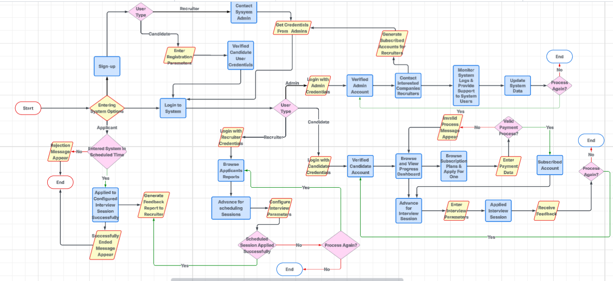

# Flowcharts

These exported flowcharts document the main IISS processing workflow and the individual AI/interaction modules.

| Flowchart | Purpose |
| --- | --- |
| [System_Flowchart.png](System_Flowchart.png) | End-to-end interview simulation workflow. |
| [Avatar.png](Avatar.png) | Avatar interaction flow. |
| [Deepseek.png](Deepseek.png) | LLM/question-answering integration flow. |
| [Speech_to_Text.png](Speech_to_Text.png) | Speech transcription flow. |
| [Text_to_Speech.png](Text_to_Speech.png) | Voice synthesis flow. |
| [Facial_Expression.png](Facial_Expression.png) | Facial-expression analysis flow. |
| [Eye_Tracking.png](Eye_Tracking.png) | Eye-tracking analysis flow. |
| [Tone_Analysis.png](Tone_Analysis.png) | Audio tone-analysis flow. |
| [Verification.png](Verification.png) | Candidate verification flow. |
| [Mobile.png](Mobile.png) | Mobile workflow. |
| [Multi_Face.png](Multi_Face.png) | Multi-face detection flow. |

## Preview

