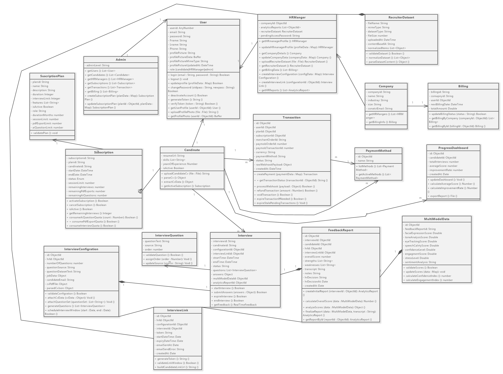
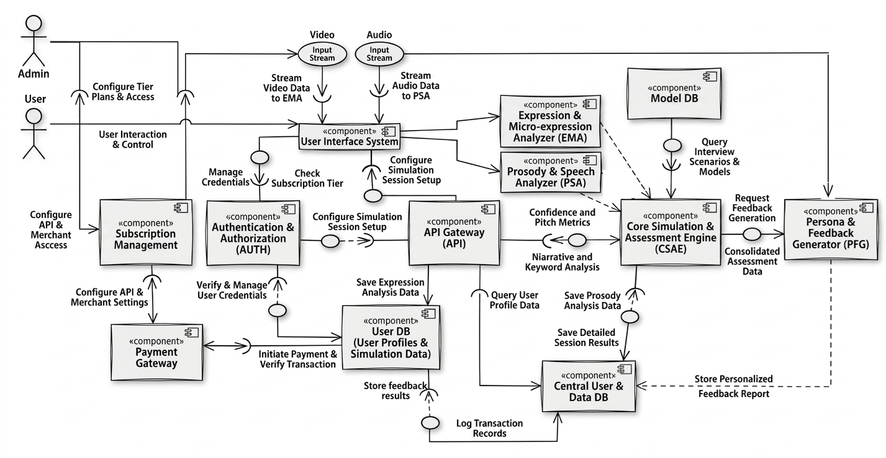

# UML And Data Diagrams

This folder contains the reviewed structural exports from the original project documentation.

| Diagram | Purpose |
| --- | --- |
| [Use_Case_Diagram.png](Use_Case_Diagram.png) | Main actors and use cases. |
| [Use_Case_Diagram_Edited.jpg](Use_Case_Diagram_Edited.jpg) | Alternate edited use-case export. |
| [Class_Diagram.png](Class_Diagram.png) | Domain classes and relationships. |
| [Component_Diagram.png](Component_Diagram.png) | Major software components and dependencies. |
| [Object_Diagram.png](Object_Diagram.png) | Runtime object relationship snapshot. |
| [Package_Diagram.png](Package_Diagram.png) | Package/module organization. |
| [Communication_Diagram.jpeg](Communication_Diagram.jpeg) | Communication-level interaction view. |
| [Sequence_Diagram.jpeg](Sequence_Diagram.jpeg) | Representative sequence flow. |
| [Timing_Diagram.jpeg](Timing_Diagram.jpeg) | Timing-oriented interaction view. |
| [ERD.png](ERD.png) | Database entity relationship diagram. |

Editable sources are stored in [../sources/uml](../sources/uml/).

## Preview

